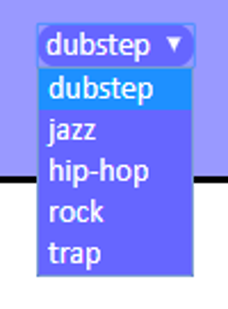
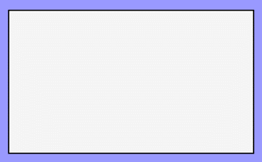
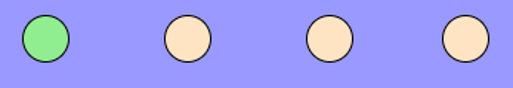
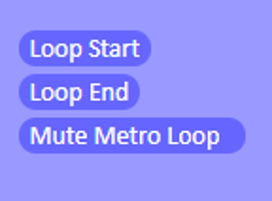
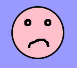

# THA SULLIVATOR 

  

## Introduction

"Tha Sullivator" can be seen as a new kind of instrument, which allows you to play in a more intuitive way. For this reason it is perfect for musicians but also for everyone who wants to approach this world.
In fact with this application you can draw on the touch pad and get a sound.
This is mainly a percussive instrument, but it has some automatic harmonic progressions and an oscillator with modifiable parameters controlled by your drawing. 

## How to use it 

### Styles

  

You can choose between five music genres:
- dubstep
- jazz
- hip-hop
- rock
- trap

You can choose the style you prefer with the selector in the right bottom of the application. Each genre has different percussive sounds and harmonic progressions.

### Touch pad

  

It is the main rectangular white board in the center of the interface and it is the area dedicated for the drawing.
The possible geometries are: 
- Dot: bass drum
- Vertical line: snare
- Horizontal line: hi-hat
- Oblique line: different filler sounds depending on the chosen style

### Metronome 

  
 
  

It works mainly as a common click: you can set the bpm value, start it, stop it and choose the stressed beats. Furthermore, you can increase the number of beats by clicking on the '+' button and remove each one by doubleclicking on the circles. Finally you can also mute the click but still visualize it.

### Loop station 

  

Tha Sullivator works also as a loop station: you can do some loops in which you will see reappearing the drawings that you have done each time the loop repeats, obviously with their related sounds. You can start it, stop it and also mute the click while the loop is playing.

 

  

 

You can delete the current loop by clicking on the rubber button.

### Harmonic Progressions

 

  

 

The controlling area for this task is the pink canvas "with eyes".
For each music genre you have two harmonic progressions depending on two moods: one "happy", choosable by drawing an happy smile, and one "sad" that you can obtain by drawing a sad emoji.

 

  

 

Once you are bored...

 

  

 

...you can stop it by simply drawing a bored face.

## Jazz progressions
You can choose the scale and how much ‘’happy’’ or ‘’sad’’ the progression must be with these sliders:

  

It has four steps with increasing behaviour related to the main mood and the scales are arranged following the Circle of Fifths.
### Example: Happy 2

   

## Demo

- You can find the demonstration video here: https://www.youtube.com/watch?v=BmGe9XnO-hw
- You can try the application here: https://nicolobotti.github.io/

So let's choose the style you want, set a tempo with the bpm selection and start your cool loops!

Developed by Nicolò Botti, Tommaso Botti and Andrea Eugenio Losi.

